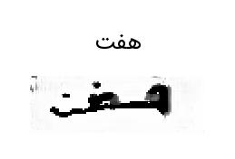

<p align="center">
  <h1 align="center">Synthetic Persian Text Image Generation</h1>
</p>

Unofficial PyTorch implementation of the following paper:

<blockquote>
<strong>Adversarial Generation of Handwritten Text Images Conditioned on Sequences</strong>

Eloi Alonso, Bastien Moysset, Ronaldo Messina

<a>https://arxiv.org/pdf/1903.00277.pdf</a>

<p align="justify"><strong><em>Abstract</em></strong>: State-of-the-art offline handwriting text recognition systems tend to use neural networks and therefore require a large amount of annotated data to be trained. In order to partially satisfy this requirement, we propose a system based on Generative Adversarial Networks (GAN) to produce synthetic images of handwritten words. We use bidirectional LSTM recurrent layers to get an embedding of the word to be rendered, and we feed it to the generator network. We also modify the standard GAN by adding an auxiliary network for text recognition. The system is then trained with a balanced combination of an adversarial loss and a CTC loss. Together, these extensions to GAN enable to control the textual content of the generated word images. We obtain realistic images on both French and Arabic datasets, and we show that integrating these synthetic images into the existing training data of a text recognition system can slightly enhance its performance.</p>
</blockquote>

#### **Quick Links**
- [Dependencies](#Dependencies)
- [Architecture](#Architecture)
- [Getting Started](#Getting-Started)
- [Training](#Training)
- [Prediction](#Prediction)
- [Generated Images](#Generated-Images)
- [References](#References)
- [License](#License)

## Dependencies
- Install Dependencies `$ pip install -r requirements.txt`

## Architecture
<p align="center">
  <div align="center"></div>
  <div align="center">

  Fig. 1: architecture of the networks $\ \varphi$, $\ G$, $\ D$ and $\ R$.
  $\ G$ receives a chunk of noise $\ Z$ and $\ \varphi(s)$ in each ResBlock.
  Both $\ G$ and $\ D$ include a self-attention layer.
  $\ R$ is trained with only real data using the CTC loss.
  We resort to the hinge version of the adversarial loss for $\ D$.

  </div>
</p>

<p align="justify">

<div align="justify">

  <strong> Network $\ G$ </strong> The input noise, of dimension $\ 112$, is split into $\ 7$ equal-sized chunks. The
  first one is passed to a fully connected layer of dimension
  $\ 768$, whose output is reshaped to $\ 256$ $\ \times$ $\ 1$ $\ \times$ $\ 3$ (with the
  convention depth × height × width). Each of the $\ 6$
  remaining chunks is concatenated with the embedding $\ \varphi(s)$,
  and fed to an up-sampling ResBlock through Conditional
  Batch Normalization (CBN) layers. The
  consecutive ResBlocks have the following number of filters:
  $\ 256$, $\ 128$, $\ 128$, $\ 64$, $\ 32$, $\ 16$. A self-attention layer is
  used between the fourth and the fifth ResBlocks. We add
  a final convolutional layer and a tanh activation in order to
  obtain a $\ 1$ $\ \times$ $\ 64$ $\ \times$ $\ 192$ image.

  </div>

  <div align="justify">

  <strong> Network $\ D$ </strong> is made up of $\ 7$ down-sampling ResBlocks
  (with the following number of filters: $\ 16$, $\ 32$, $\ 64$, $\ 128$, $\ 256$, $\ 256$),
  a self-attention layer between the third and the fourth ResBlocks.
  We then sum the output along horizontal and vertical dimensions and project it on $\ R$.

  </div>

  <div align="justify">

  <strong> Network $\ R$ </strong>
  The auxiliary network $\ R$ is a Gated Convolutional Network.
  This network consists in an encoder of $\ 7$ convolutional layers,
  with ReLU activations and convolutional gates,
  followed by a max pooling on the vertical dimension and a decoder made
  up of $\ 2$ stacked bidirectional LSTM layers
  
  </div>
  
  <div align="justify">

  In order to control the textual content of the generated
  images, we modify the standard GAN as follows.
  First, we use a recurrent network $\ \varphi$ to encode $\ s$,
  the sequence of characters to be rendered in an image.
  $\ G$ takes this embedding $\ \varphi(s)$ as a second input.
  Then, in the generator is asked to carry out a secondary task.
  To this end, we introduce an auxiliary network for text recognition $\ R$.
  We then train $\ G$ to produce images that $\ R$
  is able to recognize correctly, thereby completing its original
  adversarial objective with a “collaboration” constraint with $\ R$. We use the
  hinge version of the adversarial loss and the $\ CTC$ loss to train this system.
  
  </div>
</p>

## Getting Started
- Project Structure
```
.
├── src
│   ├── nn
│   │   ├── Alphabet.py
│   │   ├── Discriminator.py
│   │   ├── Generator.py
│   │   └── Recognizer.py
│   ├── utils
│   │   ├── calculator.py
│   │   ├── dataProvider.py
│   │   ├── labelConverter.py
│   │   ├── misc.py
│   │   └── transforms.py
│   ├── attention.py
│   └── layers.py
├── config.py
├── prediction.py
└── train.py
```

- place dataset path in `config.py` file.
```python
ds_path = {
    "train_ds" : "path/to/train/dataset",
}
```

- DataSet Structure (each image must eventually contain a word)
```
.
├── Images
│   ├── img_1.jpg
│   ├── img_2.jpg
│   ├── img_3.jpg
│   ├── img_4.jpg
│   └── img_5.jpg
│   ...
└── labels.json
```

- `labels.json` Contents
```json
{"img_1": "بالا", "img_2": "و", "img_3": "بدانند", "img_4": "چندین", "img_5": "به", ...}
```

## Training
We use the hinge version of the adversarial loss,
and the CTC loss to train this system. Formally, $\ D$, $\ R$, $\ G$ and $\ \varphi$
are trained to minimize the following objectives:

```math
L_D = - \mathbb{E}_{(x, s) \sim Pdata} [min(0, -1 + D(x))] - \mathbb{E}_{z \sim p_z, s \sim p_w} [min(0, -1 - D(G(z, \varphi(s))))]
```

```math
L_R = + \mathbb{E}_{(x, s) \sim Pdata} [CTC(s, R(x))]
```

```math
L_{(G, \varphi)} = - \mathbb{E}_{z \sim p_z, s \sim p_w} [D(G(z, \varphi(s)))] + \mathbb{E}_{z \sim p_z, s \sim p_w} [CTC(s, R(G(z, \varphi(s))))]
```

### CTC Loss
CTC takes a sequence $\ H = h_1 , . . . , h_T$ , where $\ T$ is the sequence length, and outputs the probability of $\ \pi$, which is defined as
```math
P(\pi|H) = \prod_{t = 1}^T y_{{\pi}_t}^t
```
where $\ y_{{\pi}_t}^t$ is the probability of generating character $\ \pi_t$ at each time step $\ t$.

## Prediction
```
  python3 prediction.py -w path/to/generator/weights.pth -i <word>
```
## Generated Images
<table align = "center">
  <tr>
      <td></img></td>
      <td></img></td>
      <td></img></td>
      <td></img></td>
      <td></img></td>
      <td></img></td>
  </tr>
  
  <tr>
      <td></img></td>
      <td></img></td>
      <td></img></td>
      <td></img></td>
      <td></img></td>
      <td></img></td>
  </tr>
  
  <tr>
      <td></img></td>
      <td></img></td>
      <td></img></td>
      <td></img></td>
      <td></img></td>
      <td></img></td>
  </tr>
</table>

## References
- [Handwritten Word Generation using GANs](https://github.com/fractal2k/Handwriting-Synthesis)
## 🛡️ License <a name="license"></a>
Project is distributed under [MIT License](https://github.com/Saeed-Biabani/Synthetic-Text-image-Generation/blob/main/LICENSE)
